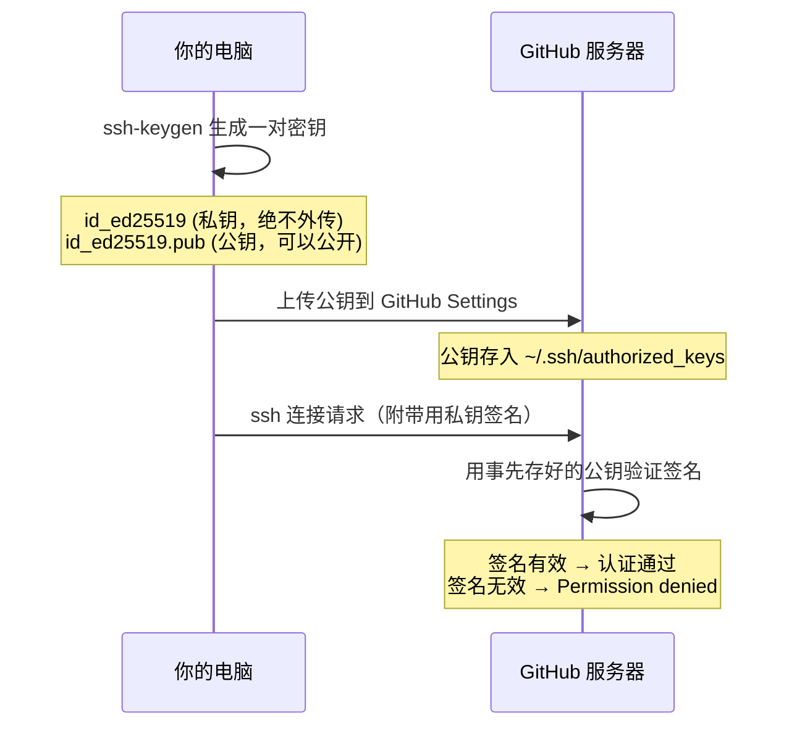
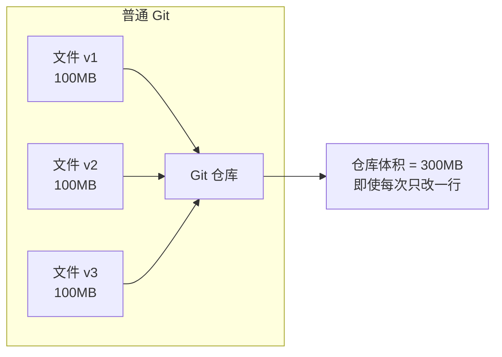
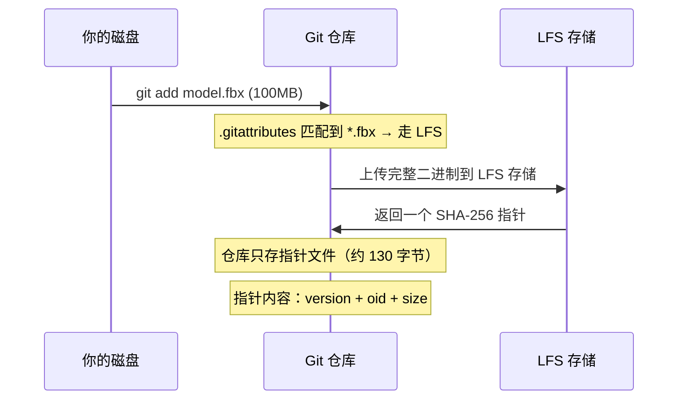
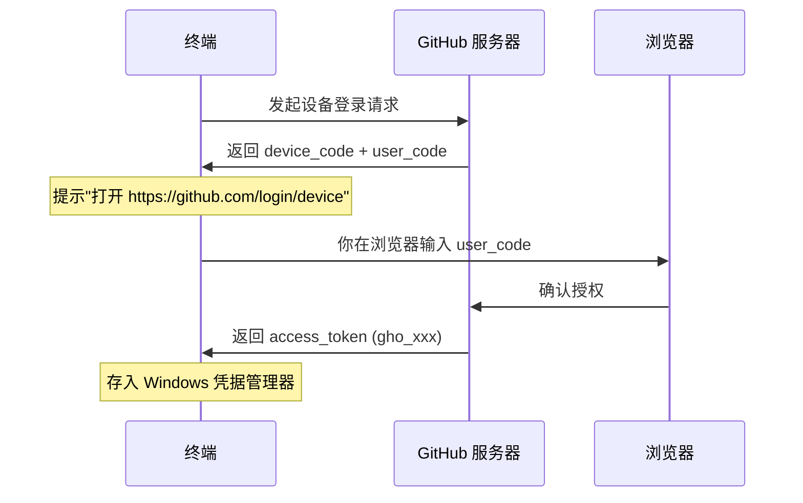

# 从零搭建 Unity AI 项目的工具链：SSH Key、Git LFS 与 GitHub CLI

> 日期：2026-05-06 | 标签：`工具链` `环境搭建` `M0`

---

## 速查卡

### SSH Key

```powershell
# 生成（一路回车）
ssh-keygen -t ed25519 -C "你的邮箱"

# 复制公钥 → 粘贴到 https://github.com/settings/keys
Get-Content ~/.ssh/id_ed25519.pub

# 验证
ssh -T git@github.com
```

| 排错 | 原因 | 解决 |
| --- | --- | --- |
| `Permission denied (publickey)` | 公钥未上传到 GitHub | 打开 GitHub Settings → SSH Keys → 粘贴 |
| `Host key verification failed` | 首次连接未确认指纹 | `ssh -T git@github.com`，输入 `yes` |

### Git LFS

```powershell
winget install Git.LFS     # 安装
git lfs install            # 在仓库中初始化
git lfs version            # 验证
```

| 排错 | 原因 | 解决 |
| --- | --- | --- |
| 仓库体积暴涨 | 二进制文件未被 LFS 管理 | 检查 `.gitattributes` 是否覆盖该文件类型 |
| CI 拉取失败 | CI 环境未装 LFS 或未 `git lfs pull` | 在 CI workflow 中 `git lfs pull` |

### GitHub CLI

```powershell
winget install --id GitHub.cli
gh auth login       # → GitHub.com → SSH → Skip → Browser
gh auth status      # 验证登录状态
```

| 排错 | 原因 | 解决 |
| --- | --- | --- |
| `read tcp ... wsarecv` 超时 | 国内直连 GitHub 不稳定 | 用 `gh auth login --with-token` 替代浏览器登录 |
| winget 找不到包 | winget 源损坏 | 直接下载 `.msi`：https://github.com/cli/cli/releases/latest |

---

## 原理深挖

### 1. SSH Key — 为什么你不用输密码

**核心问题：** 每次 `git push` 都要输入 GitHub 密码，既麻烦又不安全（密码在网络上传）。

**底层方案：非对称加密（Asymmetric Cryptography）**



**关键细节：**
- **私钥（Private Key）**: 只存在你电脑的 `~/.ssh/id_ed25519` 上，永远不要发给任何人。它是一个数学上"只有你能产生的"签名器。
- **公钥（Public Key）**: 公开到 GitHub。它只能用来**验证**签名是否为配对私钥所签，不能反推私钥。
- **认证过程不是"加密"，而是"签名"**: GitHub 发一段随机数据给你，你用私钥签名后发回来，GitHub 用公钥验证签名。整个过程没有密码传输。

**ED25519 vs RSA:**
- ED25519 是 Edwards-curve 数字签名算法，比 RSA 更短（256 bits vs 2048+ bits），安全性等价或更高，生成速度更快
- 现代 Git 服务推荐默认用 ED25519

**为什么叫 `known_hosts`？**
第一次连接 `ssh -T git@github.com` 时会问你 `yes/no`，这是**主机认证**——确认 GitHub 的 ECDSA 指纹是真的，不是中间人冒充。指纹确认后存入 `~/.ssh/known_hosts`，下次不再询问。

---

### 2. Git LFS — 为什么你的仓库会爆炸

**核心问题：** Unity 项目的 FBX 模型动辄几十 MB，ONNX 模型、纹理贴图、音频文件都是大二进制。普通 Git 如何处理这些文件？

**Git 的存储模型：快照（Snapshot）**



Git 的设计哲学是**完整快照**：每个版本的每个文件都存一份完整副本。对代码文本来说这不是问题（几 KB），但对 100MB 的 FBX 模型，每改一次就多 100MB。

**LFS 的解决方案：指针替换**



**指针文件长什么样？**

```
version https://git-lfs.github.com/spec/v1
oid sha256:4d7a214614ab2935c943f9e0ff69d22cbbf6b8a5a...
size 104857600
```

**关键细节：**
- **`.gitattributes` 是触发规则**: LFS 通过 git 的 smudge/clean filter 机制工作。`git add` 时（clean filter）把大文件替换为指针，`git checkout` 时（smudge filter）把指针还原为真实文件
- **`.gitignore` 只是忽略，LFS 才是管理**: `.gitignore` 里的文件根本不进 Git，LFS 里的文件在 Git 中**可见但高效**
- **SHA-256 是内容寻址**: 同一个文件内容产生同一个指针，天然去重

---

### 3. GitHub CLI (`gh`) — 从浏览器点到终端一行

**核心问题：** 创建 Issue、发 PR、查看 CI 日志，每次都要打开浏览器 → 登录 → 点击 → 填表 → 等加载。在终端写代码时频繁切到浏览器打断了工作流。

**`gh` 解决的三件事：**

| 手工操作（浏览器） | `gh` 一行命令 |
| --- | --- |
| GitHub → New PR → 选分支 → 写标题 → 写描述 → Create | `gh pr create --title "..." --body "..."` |
| GitHub → Actions → 点 Workflow → 看日志 | `gh run watch` |
| GitHub → Issues → New Issue → 填模板 → Submit | `gh issue create --template milestone-task.md` |

**OAuth Device Flow（怎么登录的）：**



**关键细节：**
- Token 存在 **Windows Credential Manager**（`gh auth status` 显示 `keyring`），不是明文文件
- Token scope `gist, read:org, repo` 意味着 `gh` 可以操作你的仓库、Gist 和读取组织信息
- 选择 SSH 协议后，`gh` 异步操作（API 请求）用 token，Git 操作（push/pull）用 SSH Key，两者互补

**`gh` 和 `git` 的关系：**
- `git` 管**版本控制**（commit, push, pull, merge）
- `gh` 管**GitHub 平台操作**（PR, Issue, Actions, Release）
- `gh` 不会替代 `git`，它替代的是"打开 github.com 点鼠标"

---

## 输出成果

### 当前工具链状态

```
ssh -T git@github.com      → Hi YIMO691! ✓
git lfs version             → git-lfs/3.7.1 ✓
gh auth status              → Logged in as YIMO691 ✓
```

### 这三件工具在本项目中的角色

| 工具 | 在 M0-M5 中何时用到 |
| --- | --- |
| SSH Key | 每次 `git push`、`git pull`、Claude Code 插件市场同步 |
| Git LFS | M3 训练产物（ONNX 模型）、M5 演示录屏（MP4）、大型纹理和 FBX |
| `gh` CLI | M0-M5 每个里程碑结束后发 PR、看 CI 是否通过、创建 Issue 跟踪 Bug |

---

> 下一篇预告：Unity 6 安装与项目创建（M0 Task 0.1-0.2）
