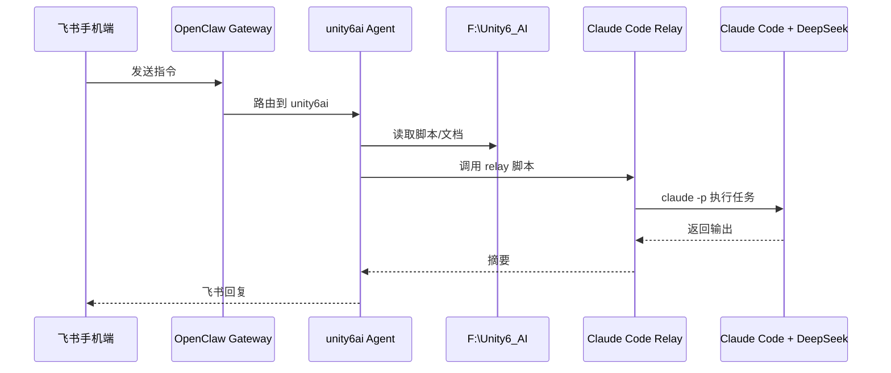
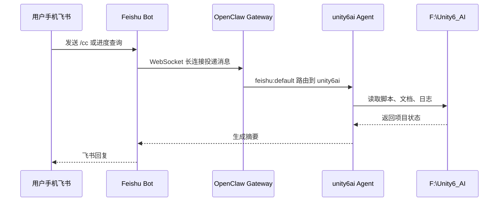
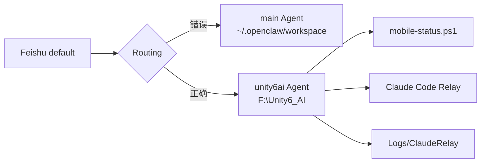
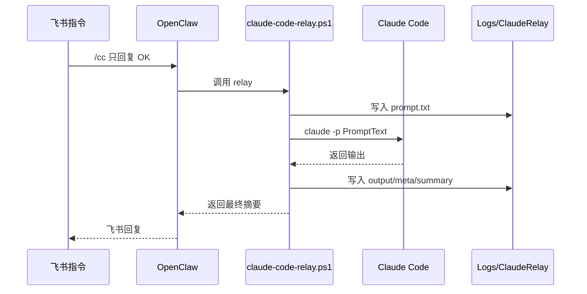
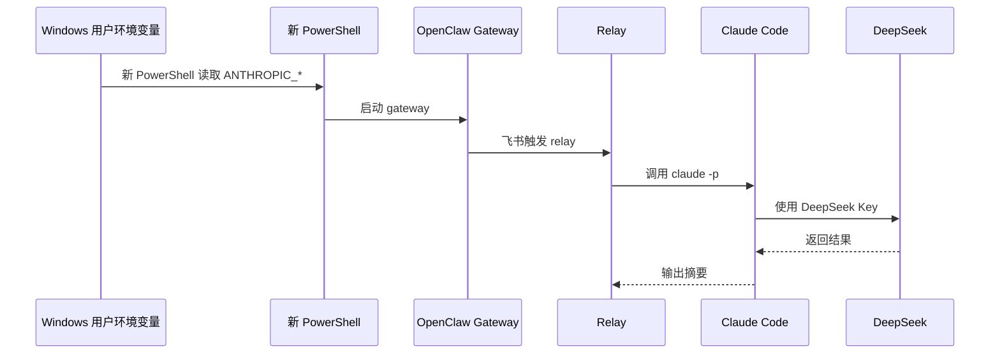
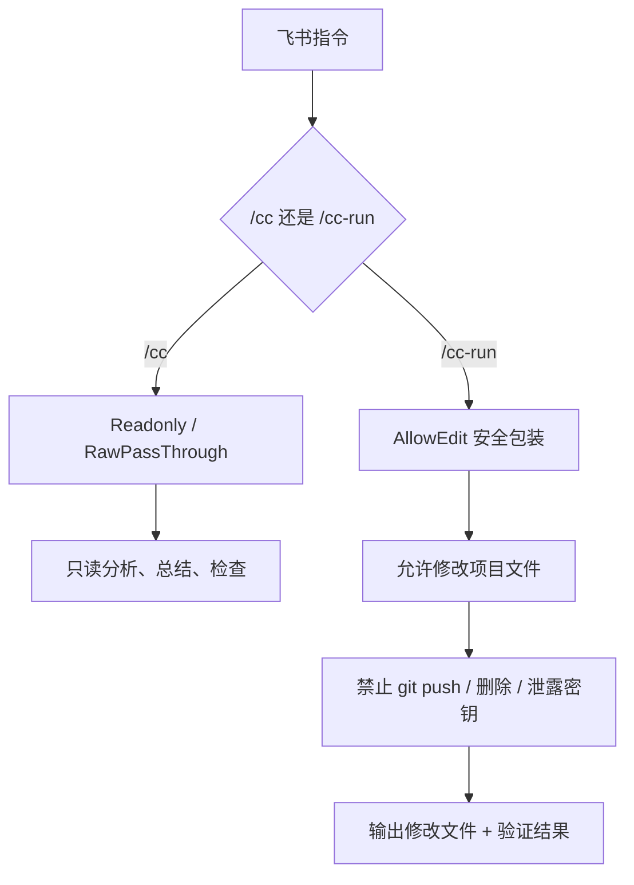
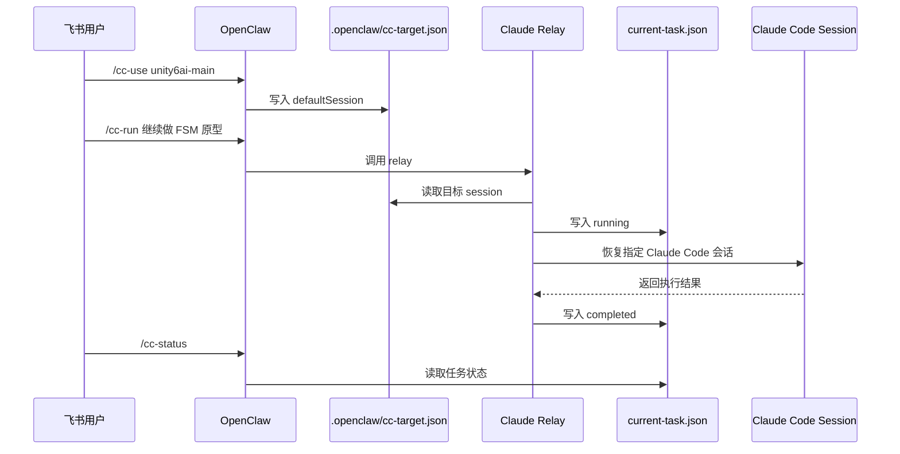

# Unity6_AI 远程开发链路搭建：飞书 + OpenClaw + Claude Code + DeepSeek

> 日期：2026-05-06 | 标签：`Unity6_AI` `OpenClaw` `飞书` `Claude Code` `DeepSeek` `远程开发` `cc-run`
>
> 三层结构：**速查卡（1-11）** · **原理深挖（1-6）** · **输出成果**

---

## 速查卡

### 1. 当前最终目标

这次工具链搭建的目标不是单纯让飞书机器人聊天，而是实现下面这条远程开发链路：



最终希望形成四类指令：

```text
/cc        只读分析：查看、总结、检查，不修改文件
/cc-run    允许编辑：让 Claude Code 修改项目文件，但禁止危险操作
/cc-status 查看当前 Claude Code 任务状态
/cc-last   查看最近一次 Claude Code 执行摘要
```

---

### 2. OpenClaw 安装与启动

```powershell
# 安装或升级 OpenClaw
powershell -c "irm https://openclaw.ai/install.ps1 | iex"

# Windows PowerShell 如果拦截 openclaw.ps1，就使用 .cmd
openclaw.cmd --version
openclaw.cmd doctor
```

| 现象 | 原因 | 解决 |
| --- | --- | --- |
| `无法加载文件 ... openclaw.ps1`，因为在此系统上禁止运行脚本 | PowerShell 执行策略阻止 npm 生成的 ps1 脚本 | 使用 `openclaw.cmd` 代替 `openclaw` |
| 安装成功但命令无法运行 | 当前 PowerShell 环境不允许执行脚本 | 临时使用 `.cmd`；长期可设置当前用户执行策略 |
| Gateway 启动失败，提示缺少 `gateway.mode` | OpenClaw 配置不完整 | 执行 `openclaw.cmd config set gateway.mode local` |

---

### 3. Feishu 插件安装与通道配置

```powershell
# 安装 Feishu 插件
openclaw.cmd plugins install @openclaw/feishu

# 如果提示插件已存在但未正常识别
openclaw.cmd plugins install @openclaw/feishu --force

# 查看插件状态
openclaw.cmd plugins list --verbose
```

成功状态类似：

```text
@openclaw/feishu (feishu) enabled
```

然后添加 Feishu 通道：

```powershell
openclaw.cmd channels add
```

推荐选择：

```text
Group chat policy:
- Disabled：只私聊使用
- Allowlist：只允许指定群聊使用

DM access policy:
- pairing：默认推荐，需要本机批准用户

Bind configured channel accounts to agents now?
- Yes
```

| 现象 | 原因 | 解决 |
| --- | --- | --- |
| `plugin already exists` | 插件目录已存在，但安装记录可能不完整 | 使用 `--force` 覆盖安装 |
| `Channel feishu does not support login` | 当前 Feishu 通道不走 `channels login` | 改用 `openclaw.cmd channels add` |
| 终端二维码扫不出来 | Windows 终端字体、比例、宽度导致二维码变形 | 换 Feishu App 内置扫一扫、放大终端、或走手动配置 |
| 飞书能收到消息但不回复 | 通道未绑定 Agent 或模型不可用 | 检查 `agents list --bindings` 和 DeepSeek Key |

---

### 4. DeepSeek 作为 OpenClaw 默认模型

如果 Gateway 报：

```text
Missing API key for provider "openai"
```

说明默认 Agent 仍在尝试使用 OpenAI。当前项目目标是使用 DeepSeek，因此需要改默认模型：

```powershell
openclaw.cmd config set agents.defaults.model.primary deepseek/deepseek-chat
openclaw.cmd config get agents.defaults.model.primary
```

期望输出：

```text
deepseek/deepseek-chat
```

如果 DeepSeek Key 无效，则重新配置：

```powershell
openclaw.cmd onboard --auth-choice deepseek-api-key
```

> **注意：** API Key、Token、App Secret 不能写进项目文件、日志、Blog、截图或 Git 仓库。泄露后必须立刻轮换。

---

### 5. 创建 Unity6_AI 专用 Agent

默认 `main` Agent 的 workspace 是：

```text
C:\Users\Administrator\.openclaw\workspace
```

它会导致飞书机器人读错项目。因此创建专用 Agent：

```powershell
openclaw.cmd agents add unity6ai --workspace "F:\Unity6_AI" --model deepseek/deepseek-chat --non-interactive
```

解绑旧路由：

```powershell
openclaw.cmd agents unbind --agent main --bind feishu:default
```

绑定到新 Agent：

```powershell
openclaw.cmd agents bind --agent unity6ai --bind feishu:default
```

验证：

```powershell
openclaw.cmd agents list --bindings
```

飞书测试：

```text
你当前的 workspace 是哪里？请只回答路径，不要展开解释。
```

期望回复：

```text
F:\Unity6_AI
```

---

### 6. Gateway 启动验证

```powershell
openclaw.cmd gateway
```

成功日志关键字段：

```text
[gateway] agent model: deepseek/deepseek-chat
[gateway] ready
[feishu] feishu[default]: WebSocket client started
[ws] ws client ready
```

飞书私聊机器人：

```text
你好
```

如果 Gateway 日志出现：

```text
received message
dispatching to agent
dispatch complete
```

说明飞书消息已经进入 OpenClaw。

---

### 7. 项目状态脚本 mobile-status.ps1

本地执行：

```powershell
cd F:\Unity6_AI
powershell -ExecutionPolicy Bypass -File ".\tools\mobile-status.ps1"
```

这个脚本负责汇总：

```text
Git 分支
最近提交
当前修改
PROGRESS.md
TODO.md
AI_DEV_LOG.md
项目本地 Logs
可能的 Unity 错误
```

重要修正：只读取项目本地日志，不读取全局 Unity Editor.log。

```text
读取：
F:\Unity6_AI\Logs\EditModeBatch.log
F:\Unity6_AI\Logs\EditModeResults.xml
F:\Unity6_AI\Logs\UnityBatch.log

不读取：
C:\Users\Administrator\AppData\Local\Unity\Editor\Editor.log
```

| 现象 | 原因 | 解决 |
| --- | --- | --- |
| 飞书报告出现旧项目错误（如 `CityView.cs`、`ChatPanel`） | 读取了全局 Unity Editor.log | 修改脚本，只读取项目本地 Logs |
| `未找到项目本地 Unity 日志` | 当前项目还没运行测试或构建 | 等运行 Unity 测试后再生成本地 Logs |
| `Unity project structure may be incomplete` | 当前根目录不是 Unity 工程本体 | 后续可增强脚本识别 `UnityProject/Assets` |

---

### 8. Claude Code + DeepSeek 环境变量

Claude Code 通过 DeepSeek 使用时，需要配置 Anthropic 兼容环境变量。

临时方式：

```powershell
$env:ANTHROPIC_BASE_URL="https://api.deepseek.com/anthropic"
$env:ANTHROPIC_AUTH_TOKEN="你的新 DeepSeek Key"
$env:ANTHROPIC_MODEL="deepseek-v4-pro[1m]"
$env:ANTHROPIC_DEFAULT_OPUS_MODEL="deepseek-v4-pro[1m]"
$env:ANTHROPIC_DEFAULT_SONNET_MODEL="deepseek-v4-pro[1m]"
$env:ANTHROPIC_DEFAULT_HAIKU_MODEL="deepseek-v4-flash"
$env:CLAUDE_CODE_SUBAGENT_MODEL="deepseek-v4-flash"
$env:CLAUDE_CODE_EFFORT_LEVEL="max"
```

为了让 OpenClaw Gateway 启动的子进程也能调用 Claude Code，建议写入 Windows 用户环境变量：

```powershell
[Environment]::SetEnvironmentVariable("ANTHROPIC_BASE_URL", "https://api.deepseek.com/anthropic", "User")
[Environment]::SetEnvironmentVariable("ANTHROPIC_AUTH_TOKEN", "你的新DeepSeekKey", "User")
[Environment]::SetEnvironmentVariable("ANTHROPIC_MODEL", "deepseek-v4-pro[1m]", "User")
[Environment]::SetEnvironmentVariable("ANTHROPIC_DEFAULT_OPUS_MODEL", "deepseek-v4-pro[1m]", "User")
[Environment]::SetEnvironmentVariable("ANTHROPIC_DEFAULT_SONNET_MODEL", "deepseek-v4-pro[1m]", "User")
[Environment]::SetEnvironmentVariable("ANTHROPIC_DEFAULT_HAIKU_MODEL", "deepseek-v4-flash", "User")
[Environment]::SetEnvironmentVariable("CLAUDE_CODE_SUBAGENT_MODEL", "deepseek-v4-flash", "User")
[Environment]::SetEnvironmentVariable("CLAUDE_CODE_EFFORT_LEVEL", "max", "User")
```

重新打开 PowerShell 后测试：

```powershell
claude -p "Reply with exactly: OK"
```

期望输出：

```text
OK
```

| 现象 | 原因 | 解决 |
| --- | --- | --- |
| `Not logged in · Please run /login` | Claude Code 没拿到 `ANTHROPIC_*` 环境变量 | 写入用户级环境变量并重启 PowerShell |
| 本地能跑，飞书触发不能跑 | Gateway 是旧窗口启动的，没有继承新变量 | 在能跑 `claude -p OK` 的 PowerShell 里重启 Gateway |
| API Key 泄露 | 把 Key 贴进聊天或日志 | 立刻去平台控制台轮换 Key |

---

### 9. Claude Code Relay

只读状态查询：

```powershell
powershell -NoProfile -ExecutionPolicy Bypass -File ".\tools\claude-code-relay.ps1" -PromptText "查看当前项目状态，只总结，不要修改任何文件"
```

原话直传：

```powershell
powershell -NoProfile -ExecutionPolicy Bypass -File ".\tools\claude-code-relay.ps1" -PromptText "只回复 OK" -RawPassThrough
```

成功输出：

```text
Claude Code 最终摘要:
状态：已完成
摘要：
OK
```

| 现象 | 原因 | 解决 |
| --- | --- | --- |
| 中文输出乱码：`浠ヤ笅鏄...` | PowerShell 按错误编码读取 UTF-8 | 在脚本顶部设置 UTF-8，并让读写文件显式使用 `-Encoding UTF8` |
| "只回复 OK"却返回项目状态总结 | relay 包装提示词写死了项目状态总结 | 增加 `-RawPassThrough`，确保 PromptText 原样传给 Claude Code |
| relay 调用失败，但 `claude -p OK` 成功 | 脚本子进程环境不同 | 确保从同一 PowerShell 环境启动 |

---

### 10. 飞书触发 Claude Code Relay

飞书中发送：

```text
请运行：
powershell -NoProfile -ExecutionPolicy Bypass -File "F:\Unity6_AI\tools\claude-code-relay.ps1" -PromptText "只回复 OK" -RawPassThrough

只返回 Claude Code 最终摘要。
```

成功回复：

```text
Claude Code 最终摘要：
状态：已完成，退出码 0。摘要：OK
```

真实状态查询：

```text
请运行：
powershell -NoProfile -ExecutionPolicy Bypass -File "F:\Unity6_AI\tools\claude-code-relay.ps1" -PromptText "查看当前项目状态，100字内总结，不要修改文件" -RawPassThrough

只返回 Claude Code 最终摘要。
```

成功回复：

```text
Phase 0/1 基本完成：UnityProject 已创建清理，场景就绪，文档分类完毕，飞书/手机状态查询可用。待办：重开 Unity 验证 Console 无新错误，然后开始 FSM 敌人 AI 原型。
```

---

### 11. /cc-run 设计

`/cc` 是只读命令，适合：

```text
/cc 查看当前项目状态，100字内总结，不要修改文件
/cc 检查 TODO.md，告诉我下一步应该做什么，不要修改文件
```

`/cc-run` 是允许编辑命令，适合：

```text
/cc-run 请在 AI_DEV_LOG.md 末尾追加一条测试记录：feishu cc-run smoke test completed。不要修改其他文件。
```

安全规则：

```text
允许：
- 修改 F:\Unity6_AI 项目内普通源码、文档、配置文件
- 运行必要的本地检查或测试
- 更新 PROGRESS.md、TODO.md、AI_DEV_LOG.md
- 写入 Logs/ClaudeRelay

禁止：
- git push
- 删除项目目录
- Remove-Item -Recurse / del /s / rmdir /s / rm -rf
- 输出或保存 API Key、Token、App Secret、密码
- 修改 OpenClaw、Claude Code、DeepSeek 密钥配置
- 安装未知全局工具
- 修改 Windows 系统级设置
- 自动 git commit，除非用户明确允许
```

本地测试建议：

```powershell
powershell -NoProfile -ExecutionPolicy Bypass -File ".\tools\cc-run.ps1" -PromptText "请在 AI_DEV_LOG.md 末尾追加一条测试记录：cc-run smoke test completed。不要修改其他文件。"
```

飞书测试建议：

```text
/cc-run 请在 AI_DEV_LOG.md 末尾追加一条测试记录：feishu cc-run smoke test completed。不要修改其他文件。
```

---

## 原理深挖

### 1. OpenClaw 在这套链路中的角色

**核心问题：** Claude Code 适合在电脑上开发项目，但用户外出时无法方便地查看进度、下达任务和读取执行结果。OpenClaw 负责把手机飞书消息转成本机 Agent 操作。

**底层方案：GFeishu Bot + OpenClaw Gateway + Agent 路由**



**关键细节：**
- Feishu 使用 WebSocket 长连接，不需要公网 Webhook。
- `feishu:default` 必须绑定到 `unity6ai`，否则会落到默认 `main` Agent。
- Agent 的 workspace 决定它读哪个项目。

---

### 2. 为什么要做 unity6ai Agent

**核心问题：** OpenClaw 默认 `main` Agent 工作目录不是 `F:\Unity6_AI`，它可能读取旧项目、旧日志或旧上下文，导致飞书回复错误。

**底层方案：项目专属 Agent + 明确绑定**



**关键细节：**
- `agents add unity6ai --workspace "F:\Unity6_AI"` 创建项目专属 Agent。
- `agents unbind main` 避免飞书继续走旧 Agent。
- `agents bind unity6ai` 后，飞书才会准确进入当前项目目录。

---

### 3. 为什么 Claude Code 需要 Relay 脚本

**核心问题：** 如果让飞书消息直接执行命令，会存在安全风险；如果每次都人工复制命令，又失去远程控制意义。Relay 脚本是安全边界和日志中心。

**底层方案：受控执行 + 日志落盘**



**关键细节：**
- relay 固定工作目录为 `F:\Unity6_AI`。
- 每次执行都生成 `prompt.txt`、`output.txt`、`meta.json`、`summary.txt`。
- `-RawPassThrough` 用来保证"原话传递"。
- `-AllowEdit` 用来实现 `/cc-run`，但必须附加安全规则。

---

### 4. 为什么飞书触发时经常遇到环境变量问题

**核心问题：** PowerShell 的 `$env:...` 是进程级变量。你在一个窗口里设置了 Key，不代表 OpenClaw Gateway 的进程也能读取。

**底层方案：用户级环境变量 + 从新 PowerShell 启动 Gateway**



**关键细节：**
- 设置用户级变量后，需要重新打开 PowerShell。
- Gateway 必须从能成功运行 `claude -p "Reply with exactly: OK"` 的窗口启动。
- 如果飞书触发时报 `Not logged in`，优先检查 Gateway 继承的环境变量。

---

### 5. /cc 与 /cc-run 的边界

**核心问题：** 远程开发不能一开始就全自动修改代码。必须区分"只读分析"和"允许编辑"。

**底层方案：双命令模型**



**关键细节：**
- `/cc` 默认不修改文件。
- `/cc-run` 必须显式触发。
- `/cc-run` 执行前后应记录 `git status --short`。
- 任何删除文件、推送代码、修改密钥配置的行为都必须拦截或拒绝。

---

### 6. 为什么要支持指定 Claude Code 会话 / 分支

**核心问题：** 如果每次调用都是新的临时 Claude Code 会话，长期任务上下文会丢失。指定 session/branch 后，可以让 Claude Code 持续在同一个开发分支中工作。

**底层方案：cc-target + current-task**



**关键细节：**
- `/cc-use <session>` 指定默认 Claude Code 会话。
- `/cc-status` 查看当前任务是否运行、完成或失败。
- `/cc-last` 查看上一次执行摘要。
- 这会让外出远程开发从"一次性指令"升级成"持续任务控制"。

---

## 输出成果

### 当前状态

```text
已完成：
- OpenClaw 已安装并可通过 openclaw.cmd 使用
- Feishu 插件已安装并启用
- Feishu default 通道已配置成功
- Gateway mode 已设置为 local
- DeepSeek 模型已配置为默认模型
- Gateway 可正常启动
- Feishu WebSocket ready
- 创建 unity6ai Agent，workspace = F:\Unity6_AI
- feishu:default 已绑定到 unity6ai
- 飞书能读取 F:\Unity6_AI 项目状态
- mobile-status.ps1 已修正，只读取项目本地 Logs
- Claude Code 环境变量已可用于 headless 模式
- claude -p "Reply with exactly: OK" 已验证
- claude-code-relay.ps1 本地调用成功
- 中文乱码已修复
- -RawPassThrough 原话直传已验证
- 飞书已能触发 relay 并返回 Claude Code 摘要
- 飞书测试 "只回复 OK" 成功
- 飞书测试 "100字内总结项目状态" 成功

已实现：
- /cc 全局状态检查 — 已完成
- /cc-run relay 编辑任务（超时 20min，带安全+日志）— 已完成
- /cc-status 里程碑进度 — 已完成
- /cc-last Git 记录 + 未提交变更 — 已完成
- /cc-sessions Claude Code 会话列表（`.openclaw/cc-sessions.json`）— 已完成
- /cc-use 切换 CC 目标会话 — 已完成
- /cc-session 已迁移为 /oc-session（查 Agent 运行时）— 已完成
- /oc-sessions Gateway 活跃会话 — 已完成

命令命名规范：
- `/cc-*` = Claude Code 相关（会话、任务、目标）
- `/oc-*` = OpenClaw 相关（Agent 运行时、网关状态）
```

### 关键验证记录

```text
本地 Claude Code：
claude -p "Reply with exactly: OK"
=> OK

本地 Relay：
powershell -NoProfile -ExecutionPolicy Bypass -File ".\tools\claude-code-relay.ps1" -PromptText "只回复 OK" -RawPassThrough
=> 摘要：OK

飞书 Relay：
运行 F:\Unity6_AI\tools\claude-code-relay.ps1，只传给 Claude Code：只回复 OK
=> Claude Code 最终摘要：状态：已完成，退出码 0。摘要：OK

飞书项目状态：
查看当前项目状态，100字内总结，不要修改文件
=> Phase 0/1 基本完成，待办是重开 Unity 验证 Console，并开始 FSM/NavMesh 原型。
```

### 在项目中的角色

```text
工具/概念                | 在 Unity6_AI 中的作用
------------------------|----------------------------------------
OpenClaw Gateway        | 本机自动化网关，把飞书消息转成本机 Agent 操作
Feishu Bot              | 手机端入口，外出时查看进度和下达指令
DeepSeek                | OpenClaw 和 Claude Code 的模型后端
unity6ai Agent          | 项目专属 Agent，绑定 workspace 到 F:\Unity6_AI
mobile-status.ps1       | 聚合 Git、文档、日志、测试状态
claude-code-relay.ps1   | 把飞书任务传递给 Claude Code，并保存执行日志
Logs/ClaudeRelay        | 保存每次 Claude Code 执行的 prompt/output/meta/summary
/cc                     | 只读远程分析命令
/cc-run                 | 远程执行编辑命令，带安全边界
/cc-status              | 查看当前 Claude Code 任务状态
/cc-last                | 查看最近一次 Claude Code 执行摘要
/cc-use                 | 指定 Claude Code 会话或分支
```

### 下一步清单

```text
1. 补完 Milestone 0 收尾
   安装 behavior / ml-agents / sentis 包
   创建 _Project/Tests/EditMode/SmokeTest.cs
   Git 首次提交

2. 打开 Unity 验证场景
   确认 Main.unity 无报错
   Play 模式下地面 + 光照正常

3. 启动 Milestone 1 — FSM 敌人 AI 原型
   EnemyState 枚举
   EnemyFSM.cs 巡逻→追逐→攻击
   场景中挂载测试
```
