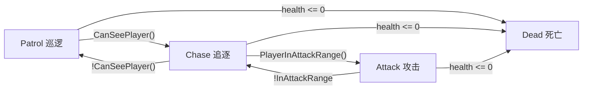
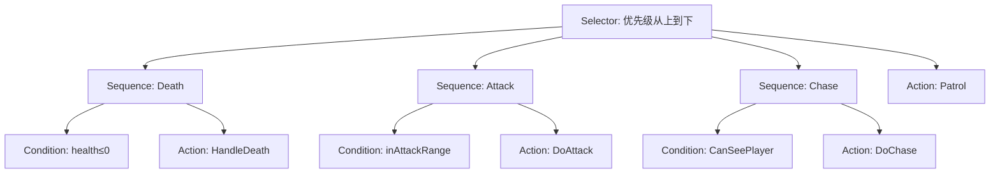
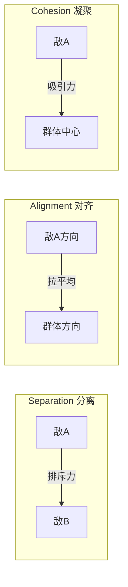

# M1 FSM → M2 行为树：Unity 6 AI 架构演进实战

> 日期：2026-05-07 | 标签：`M1` `M2` `FSM` `BehaviorTree` `Boids` `C#` `架构`

---

## 速查卡

### M1 — FSM 核心代码

```csharp
// EnemyState.cs — 四种状态枚举
public enum EnemyState { Patrol, Chase, Attack, Dead }

// EnemyFSM.cs — switch 状态机（约 150 行）
void Update() {
    switch (_currentState) {
        case EnemyState.Patrol: Patrol(); break;
        case EnemyState.Chase:  Chase();  break;
        case EnemyState.Attack: Attack(); break;
    }
}
```

```powershell
# 场景文件
Demo1_FSM.unity  # 1 个 Enemy + Player + NavMesh + 障碍物
```

| 参数 | 默认值 | 位置 |
| --- | --- | --- |
| sightRange | 15 | Inspector → EnemyFSM |
| sightAngle | 120 | Inspector → EnemyFSM |
| attackRange | 2 | Inspector → EnemyFSM |
| patrolSpeed / chaseSpeed | 2 / 5 | Inspector → EnemyFSM |

### M2 — 行为树核心代码

```csharp
// EnemyBT.cs — BuildTree() 定义树结构（约 30 行）
void BuildTree() {
    _root = new BTSelector(new List<BTNode> {
        new BTSequence { condition: IsDead,     action: HandleDeath },
        new BTSequence { condition: InAttackRng, action: DoAttack },
        new BTSequence { condition: CanSeePlayer, action: DoChase },
        new BTAction(DoPatrol)  // fallback, always runs
    });
}
```

```powershell
# 场景文件
Demo2_Behavior.unity  # 1 个 EnemyBT 敌人
Demo2_Swarm.unity     # 5 个 EnemyBT + SeparationForce 敌人
```

### M1 vs M2 对比

| 维度 | FSM (M1) | Behavior Tree (M2) |
| --- | --- | --- |
| 决策结构 | 扁平 switch | 树形优先级 Selector |
| 加新行为 | 改 switch 分支 | 插新 Sequence |
| 代码行数 | ~150 行（含所有状态逻辑） | ~160 行（BuildTree 仅 30 行，其余是节点复用库） |
| 可读性 | 分散在 switch 各分支 | `BuildTree()` 自解释 |
| 群体支持 | 无 | SeparationForce（Boids 三规则） |

---

## 原理深挖

### 1. FSM — 为什么你会从 switch 开始

**核心问题：** 单一敌人的行为有明确的顺序——巡逻时不会攻击，死亡时不该移动。FSM 用"状态 + 转换条件"完美描述了这个问题。

**底层方案：enum + switch**



**关键细节：**
- `[SerializeField] private` + Inspector 调参让 FSM 的行为可实时调试，不需要每次改代码重新编译
- `NavMeshAgent` 负责寻路，FSM 只负责"去哪"和"何时打"
- 巡逻用 `NavMesh.SamplePosition` 在随机球体内找合法导航点，解决了"随机点可能在墙外"的问题

**局限性（为什么需要升级到 BT）：**
- 加一个新状态（比如"受伤硬直"）需要在 switch 里加 `case`，同时在多个状态的转换条件里加逻辑
- 状态扁平，没有"先做什么再做什么"的优先级
- 状态转换条件散落在各个方法里，改一处可能影响其他转换

---

### 2. Behavior Tree — 从扁平到树形

**核心问题：** 当敌人行为变复杂（攻击前先嘲讽？受伤后先闪避？），switch 的复杂度线性增长。行为树用"优先级+组合"解决。

**底层方案：Selector（选择器）+ Sequence（顺序器）**



**关键细节：**
- **Selector 是"或"逻辑** — 从上往下跑子节点，第一个成功的就停。高优先级行为（死亡 > 攻击 > 追逐 > 巡逻）自然靠排列位置实现
- **Sequence 是"且"逻辑** — 先检查条件，条件通过才执行动作。条件失败则整个 Sequence 失败，Selector 跳到下一个
- **6 个节点类（BTNode, BTSelector, BTSequence, BTCondition, BTAction）不到 100 行**，但可以组合出任意复杂度的 AI
- `BuildTree()` 是树结构的 DSL——C# 的 `new List<BTNode>` 嵌套就是树的代码表达

**代码量对比：**

| | M1 FSM | M2 BT |
| --- | --- | --- |
| 决策框架 | 0（语言内建） | 100 行（6 个节点类） |
| 敌人逻辑 | 150 行 | 110 行 |
| 总计 | 150 行 | 210 行 |
| 但 M2 的 100 行框架是**所有后续敌人都能复用的** |

---

### 3. Unity Behavior 可视化评估

**核心问题：** Unity 6 内置了 Behavior 包（可视化行为图），为什么不用？

**试验结论：不适合战斗 AI**

| 需求 | Unity Behavior | C# BT |
| --- | --- | --- |
| 随机巡逻点 | 内置 Patrol 节点功能有限 | `Random.insideUnitSphere` 任意定制 |
| 视线角度检测 | 条件表达式难以实现 | `Vector3.Angle` 一行 |
| Raycast 遮挡 | 图里无法实现 | 三行 `Physics.Raycast` |
| Inspector 调参 | 需要 Blackboard 手动绑定 | `[SerializeField]` 自动暴露 |
| 版本控制 | 二进制 .asset 文件，diff 不可读 | 纯文本 .cs，Git 友好 |

**结论：** Behavior Graph 适合简单的触发式逻辑（"玩家进入区域 → 播放动画"），不适合需要每帧精确计算的战斗 AI。**代码行为树是正确的选择。**

---

### 4. Boids 算法 — 为什么 5 个敌人不会挤在一起

**核心问题：** 多个 NavMeshAgent 都追同一个目标时，它们会全部走到同一点——堆叠在玩家身上，既不真实也不好玩。

**底层方案：分离（Separation）+ 对齐（Alignment）+ 凝聚（Cohesion）**



**关键细节：**
- **分离权重最大（2.0）** — 防止重叠是第一要务
- **对齐权重中等（0.5）** — 让敌人看起来像一个队伍在追
- **凝聚权重最小（0.3）** — 只是轻微引导，不强制所有敌人挤在一点
- 排斥力与距离成反比：`(posA - posB) / dist`，越近斥力越大
- 计算结果加到 `NavMeshAgent.destination` 上实现平滑偏移

| 排错 | 原因 | 解决 |
| --- | --- | --- |
| 敌人仍然挤在一起 | SeparationForce 组件没挂或 enemyTag 不匹配 | 检查所有 Enemy Tag 是否设为 "Enemy" |
| 敌人停止移动 | Boids offset 超出 NavMesh | `NavMesh.SamplePosition` 限制偏移在可行走区域 |

---

## 输出成果

### 项目文件结构

```
Assets/_Project/Scripts/AI/
├─ FSM/                      # M1 — 有限状态机
│  ├─ EnemyState.cs          # 枚举：Patrol/Chase/Attack/Dead
│  └─ EnemyFSM.cs            # MonoBehaviour + NavMeshAgent
├─ BehaviorTree/             # M2 — 行为树
│  ├─ BTNode.cs              # 抽象基类
│  ├─ BTSelector.cs          # 优先级选择器
│  ├─ BTSequence.cs          # 顺序执行器
│  ├─ BTCondition.cs         # 条件节点
│  ├─ BTAction.cs            # 动作节点
│  └─ EnemyBT.cs             # 敌人行为树实现
└─ Swarm/                    # M2 — 群体 AI
   └─ SeparationForce.cs     # Boids 分离/对齐/凝聚
```

### 场景存档

| 场景 | 内容 |
| --- | --- |
| `Main.unity` | M0 空场景（Ground + 光照 + 摄像机） |
| `Demo1_FSM.unity` | M1 产物：1 个 EnemyFSM + Player + NavMesh + 障碍物 |
| `Demo2_Behavior.unity` | M2 Phase A：1 个 EnemyBT + Player + NavMesh |
| `Demo2_Swarm.unity` | M2 Phase B：5 个 EnemyBT + SeparationForce |

### 架构演进总结

```
M1 FSM (switch)         M2 BT (Selector/Sequence)
     ↓                        ↓
  扁平状态机              优先级行为树
  适合简单逻辑            适合复杂决策
     ↓                        ↓
                     M2 Swarm (Boids)
                          ↓
                    群体分离/对齐/凝聚
                    多敌人自然分散围攻
```

### 下一步 — M3 ML-Agents

训练环境搭建、自定义 Agent、PPO 训练、TensorBoard 监控、ONNX 导出。
