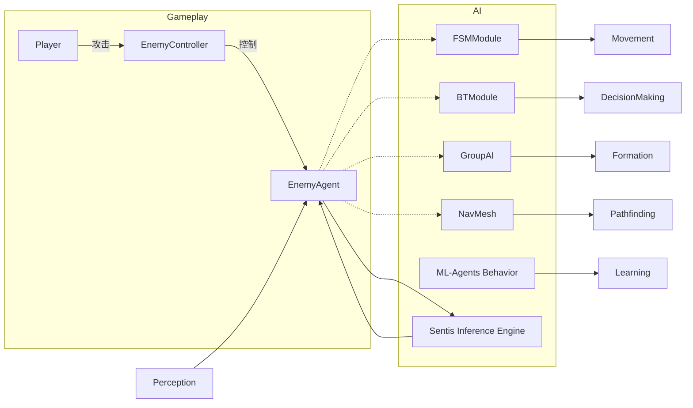
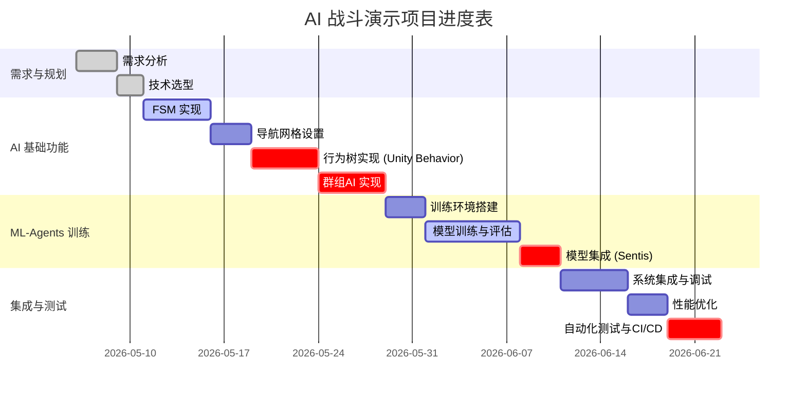

# 执行摘要

本报告为学习 Unity 6 AI 的详尽手册，涵盖**传统游戏 AI**（包括有限状态机、行为树/Unity 行为图、导航网格和感知系统）、**群体 AI**、**Unity ML-Agents**（训练流程、配置、奖励设计、观测/动作空间、训练监控）以及**Sentis/推理**（ONNX 模型导入、输入输出映射、性能优化）等多个维度。针对项目实战，报告设计了一个“**Unity 6 AI 战斗演示**”示例：从需求规格、架构设计、模块拆分到里程碑、关键代码示例、训练/推理命令、CI/CD 自动化脚本、性能优化和可交付物清单与评分标准。最后提供了分阶段学习路径规划：每阶段目标、时长建议与练习项目。文中结合官方文档与社区资源，并在适当位置引用了 Unity 官方资料、ML-Agents 文档、Sentis 手册与 DeepSeek/Claude Code 指南【2†L46-L54】【30†L80-L88】【36†L49-L58】【44†L53-L61】。  

## 传统游戏 AI

**目标：** 掌握常见的游戏 AI 技术，包括有限状态机（FSM）、行为树（Unity 内置行为图）、导航网格（NavMesh）和简单感知系统，以实现敌人巡逻、侦测与追击等行为。  
**先修知识：** 需要熟悉 Unity 编辑器基础、C# 脚本编写和基本的游戏对象操作；理解游戏编程中的基本概念（对象、组件、事件循环等）。  

**详细步骤：**  
- **有限状态机 (FSM)：** FSM 将游戏对象的行为分为有限多个状态（如“巡逻”、“追踪”、“攻击”等），并根据条件转换状态【11†L40-L45】。实现步骤：①定义枚举`enum State { Patrolling, Chasing, Attacking, Dead }`; ②在角色脚本中维护当前状态；③在`Update()`或`FixedUpdate()`中根据环境（如玩家距离、生命值等）检查条件，通过`switch`或状态表切换状态；④在每个状态中执行相应的行为（移动、攻击等）。示例代码：  

   ```csharp
   public enum EnemyState { Patrol, Chase, Attack, Dead }
   public class EnemyAI : MonoBehaviour {
       public EnemyState currentState;
       void Update() {
           switch(currentState) {
               case EnemyState.Patrol:
                   Patrol(); 
                   if (CanSeePlayer()) currentState = EnemyState.Chase;
                   break;
               case EnemyState.Chase:
                   ChasePlayer();
                   if (PlayerInAttackRange()) currentState = EnemyState.Attack;
                   if (LostPlayer()) currentState = EnemyState.Patrol;
                   break;
               case EnemyState.Attack:
                   AttackPlayer();
                   if (!PlayerInAttackRange()) currentState = EnemyState.Chase;
                   break;
               case EnemyState.Dead:
                   HandleDeath();
                   break;
           }
       }
   }
   ```
   状态机由**状态 (states)**、**转换条件 (transitions)** 和**行为 (actions)**三部分构成【11†L40-L45】。  

- **行为树/Unity 行为图：** 行为树将行为拆分为任务节点，通过树形图和条件判断组织逻辑。Unity 6 引入了**Behavior 包**，提供可视化行为图编辑器【2†L46-L54】。使用方法：①安装并打开 Unity Behavior 包，创建行为图；②拖入预置节点（如移动、检测、随机选择等）；③将节点连接成逻辑流，并绑定到角色 GameObject；④在脚本中通过行为控制角色。与传统行为树相比，Unity 行为图支持非线性分支和可观察节点等高级功能【4†L14-L22】【4†L23-L27】。示例：在行为图中定义“巡逻-发现目标-追逐-攻击”流程。  

- **导航网格 (NavMesh)：** NavMesh 定义场景中角色可行走的区域。步骤：①在场景中选中地面物体，勾选“Navigation Static”；②在“AI Navigation”包中添加 `NavMesh Surface` 组件；③设置代理尺寸（半径、高度等），点击 Bake 生成 NavMesh【7†L18-L26】；④在角色上添加 `NavMeshAgent` 组件。之后可通过脚本控制角色移动。例如，使用以下代码让敌人前往目标点【8†L47-L51】：  

   ```csharp
   using UnityEngine;
   using UnityEngine.AI;
   public class MoveTo : MonoBehaviour {
       public Transform goal;
       void Start () {
          NavMeshAgent agent = GetComponent<NavMeshAgent>();
          agent.destination = goal.position;
       }
   }
   ```
   NavMeshAgent 会自动负责路径查找和移动控制【8†L34-L42】。  

- **感知系统：** 在 Unity 中，可通过射线检测（Physics.Raycast）和触发器（Collider.OnTrigger）实现视觉/听觉感知。例如，使用 Physics.Raycast 检测敌人视线内有无玩家，或者使用多个射线扫描周围空间，判断障碍物或玩家位置。常见优化：使用 LayerMask 筛选目标层级，使用 Physics.OverlapSphere 查找近距离内的对象，避免每帧大量射线调用。  

**示例代码：**```csharp
Ray ray = new Ray(transform.position, transform.forward);
if (Physics.Raycast(ray, out RaycastHit hit, sightRange, playerLayer)) {
    // 玩家在视线范围内
}
```  

**常见错误与调试方法：**  
- 状态机逻辑错误：未正确切换状态或条件遗漏，导致角色停滞。调试：在切换处打印日志，检查状态流是否完整。  
- NavMesh未生成：确保场景物体勾选了 Navigation Static 并 Bake，或检查 Bake 设置（如步长、斜坡角度等）。可在 Scene 视图打开 Navigation 窗口查看蓝色行走区域【6†L40-L48】。  
- NavMeshAgent 无法移动：检查 NavMeshAgent 的尺寸参数，确保目标点在 NavMesh 范围内；脚本中 agent.destination 必须赋值有效位置【8†L47-L51】。  
- 感知失效：射线可能被忽略图层，或距离未设足。调试：可使用 `Debug.DrawRay` 可视化射线，或在 Scene 中显示碰撞体。  

**练习与评估：**  
- 练习项目：实现一个敌人 AI：初始**巡逻**多个点，若**玩家靠近并进入视野**则**追逐**，当玩家靠近攻击范围则**攻击**，玩家离开时切换回追逐或巡逻。检测敌人被攻击后的**死亡**状态。  
- 评估标准：角色行为是否符合需求（巡逻、发现、追逐、攻击），无明显逻辑错误；代码结构清晰；状态切换逻辑正确；性能良好（如巡逻点合理、路径顺滑）。  

**推荐资源与官方文档：** Unity 官方导航系统文档【6†L30-L38】【7†L18-L26】【8†L33-L42】；Unity 行为图手册【2†L46-L54】【4†L14-L22】；FSM 教程及资料【11†L40-L45】【14†L48-L54】。  

## 群体 AI

**目标：** 学习如何实现群组/群体智能，使多个角色协同行动（如鸟群、鱼群或队伍）。常见算法包括 **簇群行为（Boids）**：每个个体遵循**分离**、**队列/对齐**、**凝聚**三条规则【14†L48-L54】；或领导-跟随模式。  

**先修知识：** 需掌握向量数学（加权计算）、Unity 列表/数组操作及基础脚本。  

**详细步骤：**  
- **Boids 算法：** 对于群组中的每个**小体**（boid），分别计算：①**分离**：与近邻保持距离的排斥向量；②**对齐（队列）**：朝向群体平均移动方向的向量；③**凝聚**：朝向群体中心的吸引向量【14†L48-L54】。将这三种力加权组合，更新每个个体的速度和位置。实施步骤：①设置一个 **控制器** GameObject 维护所有个体的引用；②每个个体脚本中计算分离/对齐/凝聚三个向量，常用 Physics.OverlapSphere 找到邻居；③合成新的速度向量并移动个体。  

- **队形/领袖-跟随：** 对于战斗演示（多个敌人协同），可指定**队长**或**目标点**。每个成员计算与队长或相邻单位的位置关系，实现跟随或保持队形。例如每帧按一定速度朝领队位置移动，且与队伍中心点保持固定距离。  

**示例代码（简化）：**```csharp
List<GameObject> neighbors = new List<GameObject>();
Collider[] hits = Physics.OverlapSphere(transform.position, neighborRadius);
foreach (var hit in hits) {
    if (hit.gameObject != gameObject) neighbors.Add(hit.gameObject);
}
Vector3 separation = Vector3.zero, alignment = Vector3.zero, cohesion = Vector3.zero;
foreach (var boid in neighbors) {
    separation += (transform.position - boid.transform.position).normalized / (Vector3.Distance(transform.position, boid.transform.position));
    alignment += boid.GetComponent<FlockBoid>().velocity;
    cohesion += boid.transform.position;
}
separation /= neighbors.Count;
alignment /= neighbors.Count;
cohesion = (cohesion / neighbors.Count - transform.position);
velocity += separation * wSep + (alignment - velocity) * wAli + cohesion * wCoh;
transform.position += velocity * Time.deltaTime;
```  
（权重 `wSep/wAli/wCoh` 可调节三种规则的重要性）【14†L48-L54】【42†L104-L112】。  

**常见错误与调试：**  
- 个体重叠或分散太开：检查**分离力**和**凝聚力**权重设置，避免过强或过弱【14†L48-L54】。  
- 方向错乱：确保**对齐**项使用邻居平均方向而非世界坐标；调试时可绘制出各个力的矢量以观察效果。  
- 计算开销：Boids 算法为每个个体遍历邻居，当数量增大时可用优化（如网格分区或仅检测最近一批对象）。  

**练习与评估：**  
- 练习项目：创建一个鸟群或鱼群模拟：实现三大规则，使群体看起来自然流动。然后添加突发事件（如 predator）使群体**散开并重新聚集**。【14†L48-L54】  
- 评估标准：群体行为是否符合规则（可通过观察个体间距及整体运动轨迹）；性能是否可接受（大量个体时仍流畅）。  

**推荐资源与官方文档：** 游戏 AI 群体行为原理文章【14†L48-L54】【17†L35-L43】；Unity 博客和论坛的群体 AI 教程（示例使用 Boids 算法实现）【14†L48-L54】。  

## Unity ML-Agents

**目标：** 使用 Unity ML-Agents 工具包对游戏场景中的 Agent 进行强化学习训练，掌握环境配置、训练参数、奖励设计、观测与动作空间定义，以及训练过程监控。  

**先修知识：** 需要有 Python 环境（支持 ML-Agents Python 包）、熟悉强化学习基本概念（agent/环境、状态、动作、奖励）和命令行操作。  

**详细步骤：**  
1. **安装与环境搭建：** 确保已安装 Unity ML-Agents 插件并导入到项目中，同时按照官方文档安装 Python 依赖。打开包含 Agent 示例（如 Balance Ball）的场景【30†L74-L83】。  
2. **定义 Agent：** 在场景中创建或使用带有 `Agent` 组件的游戏对象。设置其 **Behavior Parameters**：定义**观察空间**和**动作空间**类型与大小。Unity 支持**向量（Vector）**和**视觉（Camera/Image）**观察【30†L74-L83】，动作支持**离散**或**连续**【30†L87-L91】。例如，平衡球示例中，观察为 8 维向量（包含球体和平台的位置信息）【30†L80-L83】，动作为 2 维连续变量（控制平台绕 X、Z 轴旋转）【30†L87-L91】。  
3. **奖励设计：** 在 Agent 的脚本中实现 `AddReward()` 或 `SetReward()` 来赋予奖励。例如，保持球在平台上的奖励正向，掉落扣分。设计时注意**稀疏奖励** vs **稠密奖励** 的平衡，同时考虑提前结束（Max Step）策略。奖励公式可结合**外部奖励**和**内在奖励信号**（如好奇心）【26†L311-L320】【26†L328-L337】。  
4. **训练配置：** 在 ML-Agents Python 项目中创建 YML 配置文件，指定算法（如 PPO）、超参数（batch_size、buffer_size、learning_rate、gamma 等）及奖励信号【26†L209-L218】【26†L311-L320】。示例配置（PPO）会列在 `config/ppo/3DBall.yaml` 等文件中。重要参数包括：`max_steps`（训练总步数）、`time_horizon`（经验回放时段长度）、`batch_size`、`buffer_size` 等【24†L72-L80】【24†L86-L94】。奖励信号部分设置 `extrinsic`（环境奖励）强度和折扣因子【26†L311-L320】。  
5. **启动训练：** 在命令行运行 `mlagents-learn <config.yaml> --run-id=<name>`【30†L139-L147】。例如：  
   ```
   mlagents-learn config/ppo/3DBall.yaml --run-id=demoRun
   ```  
   控制台出现 “Start training by pressing the Play button” 提示时，在 Unity 编辑器中按下播放按钮【30†L139-L147】。此时 Python 与 Unity 编辑器协同开始训练，智能体将不断尝试最大化累计奖励。  
6. **训练监控：** 训练时，ML-Agents 会在 `results/<run-id>` 目录中输出 TensorBoard 日志。可运行 `tensorboard --logdir results` 并访问 `localhost:6006` 查看曲线【32†L215-L223】。关键指标包括各行为的累积奖励 (`Environment/Cumulative Reward`)、损失函数、策略熵等。在训练过程中，累计奖励应逐渐提高并趋于稳定【32†L217-L223】。下图示例展示了 TensorBoard 中的曲线：  

【52†embed_image】 *（通过 TensorBoard 可视化训练进度和奖励变化【32†L217-L223】）*  

7. **保存与嵌入：** 训练完成后，`.onnx` 模型文件位于 `results/<run-id>/<BehaviorName>.onnx`。可将其拖入 Unity 资源中，并在 Agent 的 Behavior Parameters 中指定该模型进行推理【32†L229-L238】【32†L240-L246】。  

**示例训练配置片段（YML）:**```yaml
behaviors:
  CombatAgent:
    trainer_type: ppo
    max_steps: 500000
    time_horizon: 2048
    batch_size: 1024
    buffer_size: 20480
    learning_rate: 0.0003
    reward_signals:
      extrinsic:
        gamma: 0.99
        strength: 1.0
```【26†L311-L320】【24†L72-L80】  

**常见错误与调试：**  
- **奖励设置不当**：奖励过大或过小都不利于学习；**稀疏奖励**可能导致长期训练也无法学习。调试：可打印累积奖励，或设中间小目标奖励。  
- **观察/动作配置错误**：确保 Agent 的观察空间大小与脚本中的一致，动作类型（连续/离散）正确匹配。启动训练时，终端会输出如“Vector Observation space size (per agent): 8, continuous action space size: 2”【30†L80-L88】【30†L87-L91】。如果不符，需检查 Behavior Parameters 设置。  
- **TensorBoard 异常**：如果未出现日志，检查 `summary_freq` 参数和是否正确开始了训练。`summary_freq` 控制每隔多少经验（steps）写入一次日志【24†L36-L44】。  
- **训练崩溃/停滞**：可能由极端参数（如过大学习率）引起，或者环境没有及时回终止（未在完成条件下调用 `EndEpisode()`）。调试：逐渐调整超参数，或使用简单场景先试验。  

**练习与评估：**  
- 练习项目：使用 ML-Agents 训练一个智能体完成特定任务，如 **小球平衡**、**迷宫导航** 或 **打靶射击**。要求设计恰当奖励（例如，击中目标+1，超时-1），并调整算法参数以获得稳定的学习曲线。  
- 评估标准：能否在合理步数内达到预定奖励阈值（例如平衡球接近满分）; 训练日志是否显示累积奖励上升; 模型在多次测试下表现稳定；网络结构和算法选择是否合理。  

**推荐资源与官方文档：** Unity ML-Agents 官方手册【30†L74-L83】【32†L215-L223】；ML-Agents GitHub 文档（Getting Started、Training Configuration 等）【30†L139-L147】【32†L215-L223】；中文教程如 Unity 官方社区教程（可参考《ML-Agents 训练指令与配置文件》）【24†L36-L44】。  

## Sentis 推理 (ONNX 导入与性能优化)

**目标：** 学会在 Unity 中使用 Sentis（Inference Engine）导入预训练的 ONNX 模型，并进行推理。了解如何映射模型的输入输出、应用后处理，以及进行性能优化。  

**先修知识：** 需要准备好通过 ML-Agents 或其他工具训练得到的 `.onnx` 模型文件；熟悉神经网络模型输入/输出结构；掌握基本的张量操作概念。  

**详细步骤：**  
1. **模型导入：** 将 `.onnx` 文件拖入 Unity 项目的 `Assets` 文件夹【39†L13-L21】。如果模型有外部权重文件，也一并放入。Unity 会自动将其导入为**Model Asset**。在 Inspector 中，可以通过“Model Asset Import Settings”对输入尺寸进行配置【34†L40-L49】。对于动态维度（如 batch_size），可指定静态值以优化性能【34†L33-L42】。  
2. **创建运行时模型：** 在脚本中使用 `ModelLoader.Load(modelAsset)` 加载模型，获得 `Model` 对象【39†L23-L32】。示例：  

   ```csharp
   using Unity.InferenceEngine;
   public class InferenceExample : MonoBehaviour {
       public ModelAsset modelAsset;
       private Model runtimeModel;
       void Start() {
           runtimeModel = ModelLoader.Load(modelAsset);
       }
   }
   ```【39†L23-L32】  

3. **设置推理引擎 (Worker)：** 使用 `WorkerFactory.CreateWorker` 创建推理 **Worker**，选择后台（如 GPUCompute、CPU/Burst、ComputeShader）。示例：  
   ```csharp
   Worker worker = WorkerFactory.CreateWorker(BackendType.GPUCompute, runtimeModel);
   ```  
   Unity 支持使用 GPU（计算着色器/像素着色器）或 CPU(Burst) 进行推理【58†L19-L27】【58†L38-L41】。对于大多数模型，**Burst CPU** 模式通常速度更快【58†L38-L41】；GPU 通常用于具有 ResNet 视觉编码器或大量视觉智能体的场景。  

4. **准备输入张量：** 根据模型输入要求，将输入数据转为 `Tensor`。如图像数据可用 `TextureConverter.ToTensor(texture, width, height, channels)` 转换【36†L60-L68】【42†L100-L108】。注意填充正确的尺寸和通道数。示例（灰度 28x28 图像）：  
   ```csharp
   using Tensor inputTensor = TextureConverter.ToTensor(inputTexture, width:28, height:28, channels:1);
   ```【36†L60-L68】  

5. **执行推理：** 调用 `worker.Execute(inputs)` 或 `worker.Schedule(inputTensor)` 运行模型。对于有多个输入的模型，可创建字典指定输入名称（字符串）和值【42†L104-L112】。例如：  
   ```csharp
   var inputs = new Dictionary<string, Tensor> { { "images", inputImage } };
   worker.Execute(inputs);
   ```【42†L104-L112】  
   执行完成后，通过 `worker.PeekOutput(outputName)` 获取输出张量【42†L104-L112】。如无指定名称，可使用 `PeekOutput()` 获取第一个输出。对于 GPU 后端，需要在读取前调用 `outputTensor.MakeReadable()` 将数据从 GPU 拷回 CPU【42†L109-L113】。  

6. **结果处理：** 将输出张量转换为 C# 原语。例如分类模型输出向量，可通过 `Tensor<float>.DownloadToArray()` 获取结果数组【36†L70-L77】。再根据实际语义（如 Softmax 后阈值）进行后处理。  

7. **模型序列化（可选）：** 若需将模型文件打包至 `StreamingAssets` 中供运行时加载，可使用 Unity UI 将 `.sentis` 序列化模型复制到项目文件夹（Sentis 会自动生成 `.sentis` 文件）。  

**示例推理代码：**  
```csharp
using UnityEngine;
using Unity.InferenceEngine;
public class ClassifyExample : MonoBehaviour {
    public Texture2D inputTexture;
    public ModelAsset modelAsset;
    private Worker worker;
    void Start() {
        Model model = ModelLoader.Load(modelAsset);
        // 应用 Softmax 层示例（可选）
        FunctionalGraph graph = new FunctionalGraph();
        var inputs = graph.AddInputs(model);
        var outputs = Functional.Forward(model, inputs);
        var softmax = Functional.Softmax(outputs[0]);
        var runtimeModel = graph.Compile(softmax);
        // 创建推理引擎
        worker = WorkerFactory.CreateWorker(BackendType.GPUCompute, runtimeModel);
        // 准备输入张量并运行推理
        using (Tensor inputTensor = TextureConverter.ToTensor(inputTexture,28,28,1)) {
            worker.Schedule(inputTensor);
            var outputTensor = worker.PeekOutput() as Tensor<float>;
            float[] results = outputTensor.DownloadToArray();
        }
    }
    void OnDisable() {
        worker.Dispose();
    }
}
```【36†L49-L58】【36†L69-L77】（此示例使用 Sentis Functional API 构建 Softmax 层【36†L49-L58】）。  

**性能优化：**  
- **固定输入尺寸：** 在导入设置中将动态维度（例如 batch_size）设为静态值，以便 Sentis 优化模型【34†L33-L42】。  
- **选择正确设备：** 对于简单模型或少量智能体，使用 Burst CPU 模式通常比 GPU 快【58†L38-L41】；当场景使用 ResNet 视觉编码器或大量视觉智能体时，可考虑 GPU 计算着色器【58†L38-L41】。  
- **裁剪模型和层：** 移除推理不需要的层（如训练时用到的 BatchNorm/Dropout）；Sentis 可自动融合一些操作，但自定义图优化可提升速度。  
- **内存管理：** 重用 Worker 和 Tensor 对象，减少频繁创建/销毁。GPU 模式下，在获取完输出后调用 `MakeReadable()` 前，可复用同一 Worker 进行下一次推理。  

**常见错误与调试：**  
- **输入不匹配：** 模型输入名称或维度不一致会报错。调试：可在 Unity 控制台查看异常，确认 `PeekOutput("name")` 使用了正确的输出名称【42†L104-L112】。  
- **未释放资源：** GPU 设备下未调用 `Dispose()` 可能导致内存泄漏。确保在脚本销毁时调用 `worker.Dispose()`【36†L73-L77】。  
- **不能用 ML-Agents 加载外部模型：** ML-Agents 组件只支持其训练生成的 ONNX；若要加载自定义模型，需跳过 ML-Agents 直接用 Sentis【58†L45-L53】【58†L55-L58】。  

**练习与评估：**  
- 练习项目：使用任意公开模型（如 MNIST 识别或简单物体检测 ONNX）在 Unity 中实现推理。可使用相机实时捕捉画面并输入模型，输出结果显示在 UI 上。  
- 评估标准：推理结果正确率；推理速度（如在目标硬件上的帧率）；代码清晰、注释完整；是否使用了优化手段（固定输入大小、合适后端等）。  

**推荐资源与官方文档：** Unity Inference Engine 文档：**导入设置**【34†L15-L23】【34†L33-L42】、**模型加载与运行**【39†L23-L32】【36†L49-L58】；**Sentis 设备支持说明**【58†L19-L27】【58†L38-L41】。Sentis 使用示例【36†L49-L58】【42†L104-L112】。  

## 集成 Claude Code 与 DeepSeek

**目标：** 在 Unity 开发流程中引入 AI 辅助工具，提高效率：利用 **Claude Code** (Anthropic 提供的 AI 编码助手) 自动生成或补全代码，以及利用 **DeepSeek** 平台进行任务自动化、测试生成和数据集管理。  

**先修知识：** 需要具备命令行操作经验和 Node.js 环境；了解基本的 AI 助手概念。  

**详细步骤：**  
1. **安装 Claude Code：** Claude Code 是一款终端运行的代码生成工具【44†L53-L61】。在命令行中运行 `npm install -g @anthropic-ai/claude-code` 安装（需 Node.js 18+ 环境）【44†L59-L67】。安装后使用 `claude --version` 验证。  
2. **配置 DeepSeek API：** 按照 DeepSeek 文档，在环境变量中配置 `ANTHROPIC_AUTH_TOKEN` 等参数，将 Claude Code 指向 DeepSeek 的 API 接口【44†L69-L77】。例如：  
   ```bash
   export ANTHROPIC_BASE_URL=https://api.deepseek.com/anthropic
   export ANTHROPIC_AUTH_TOKEN=<你的 DeepSeek API Key>
   export ANTHROPIC_MODEL=deepseek-v4-pro
   export CLAUDE_CODE_EFFORT_LEVEL=max
   ```  
   Windows 用户使用 `$env:` 进行配置【44†L83-L92】。  
3. **使用 Claude Code 辅助编码：** 进入项目根目录，执行 `claude` 启动交互式助手【44†L93-L100】。可以输入需求描述（英文），如“Generate a C# script for enemy AI state machine in Unity” 等，Claude Code 会返回相应代码片段。生成代码后可复制到 Unity 脚本中，根据需要修改并测试。此方式可快速生成模板代码、类定义或算法实现，减少手动编码量。  
4. **结合 DeepSeek 平台：** DeepSeek 提供类 GPT 的大模型服务，可用于生成测试用例、分析代码逻辑、管理数据集等。可使用官方 API（或像 DeepSeek-Unity 插件）在 Unity 编辑器中调用。示例：使用 DeepSeek API 自动生成单元测试代码或场景描述，或使用其语义检索功能从大规模技术文档中快速查找解决方案。开发者可编写脚本，通过 HTTP 请求向 DeepSeek 发送任务，并将返回结果转换为 Unity 可用的格式。  
5. **自动化测试与数据集管理：** 可利用 Claude Code/DeepSeek 自动生成测试脚本（如 Unity Test Framework 脚本），提高覆盖率。对于机器学习项目，DeepSeek 可帮助构建和标注训练数据集：编写工具脚本自动调用 DeepSeek 进行图像/文本标签生成或清洗。配合 Continuous Integration (CI) 环境，每次代码更新后自动触发测试或训练管道。  

**示例（伪）脚本：**  
```bash
# 使用 Claude Code 生成 MonoBehaviour 脚本
claude "Generate a Unity C# script that spawns enemies and handles their states"
```  
```csharp
// 使用 DeepSeek API 生成测试用例示例（伪代码）
var request = new DeepSeekChatRequest {
    prompt = "Generate a unit test in C# for the EnemyAI class in Unity"
};
var response = deepSeekApi.ChatCompletion(request);
CreateFile("EnemyAI_Tests.cs", response.content);
```  

**常见错误与调试：**  
- **环境配置错误：** Claude Code 和 DeepSeek 需要正确的 API Token 和模型地址，否则命令行会报错无法连接。检查环境变量是否正确【44†L69-L78】。  
- **生成代码质量参差：** AI 生成的代码可能需要人工修改和完善。应结合代码审查，避免直接复制。  
- **自动测试失败：** AI 生成的测试用例可能与实际需求不匹配，需要根据实际 API/逻辑调整。  

**练习与评估：**  
- 练习项目：使用 Claude Code 生成一个 Unity 对象池管理器脚本，然后手动改进并测试其功能。使用 DeepSeek 生成几个针对行为树逻辑的测试用例，并在 Unity Test Runner 中验证通过。  
- 评估标准：AI 辅助生成的代码是否可用且正确；是否能理解和调试 AI 产出的内容；测试脚本覆盖关键功能。  

**推荐资源与官方文档：** DeepSeek 官方文档（Claude Code 集成指南）【44†L53-L61】；Claude/DeepSeek 使用教程（DeepSeek 平台文档及社区指南）。注意：目前尚无 Unity 官方对这些工具的指南，此处内容参考 DeepSeek API 文档与社区贡献。  

## Unity 6 AI 战斗演示项目

**需求规格：**  
- **游戏背景：** 3D 战斗场景，一名玩家角色与多名敌人交战。  
- **敌人 AI：** 多个敌人组成**小队**，会巡逻、追踪玩家并协同攻击。需实现常见 AI 模式（如领袖-队员、群组侦查）。  
- **玩家控制：** 玩家使用移动和攻击按钮进行战斗，与敌人交互（被伤害、击杀）。  
- **演示目标：** 展示传统 AI 与 ML 技术融合，提供战斗体验。  

### 架构设计

以下为系统模块架构图（采用 Mermaid 语法）：  



*图：示例架构（玩家、敌人、AI 模块之间的关系）。*  

### 模块分解

| 模块               | 功能描述                                          | 主要技术             |
|------------------|-------------------------------------------------|------------------|
| **PlayerController** | 玩家移动、攻击输入处理                              | Unity输入系统、角色控制 |
| **EnemyController**  | 管理敌人列表，分配任务（如巡逻路线、目标）               | C#脚本               |
| **FSMModule**     | 有限状态机：敌人状态转换（巡逻、追踪、攻击、死亡）        | FSM 逻辑              |
| **BTModule (Behavior Graph)** | 行为树：定义复杂行为流程（临时任务、反应事件）         | Unity Behavior 包    |
| **GroupAI**       | 群组行为：敌人队形与协同（凝聚、对齐、分离或领导者跟随）    | 簇群算法/领袖模式      |
| **NavMesh**       | 路径规划：根据场景几何计算移动路径                       | Unity AI Navigation  |
| **Perception**    | 感知系统：检测玩家位置和环境信息（视线、声音探测）          | Physics射线、碰撞检测  |
| **ML-Agents Module**  | 强化学习：可选的敌人控制器，通过训练行为模型实现智能决策     | Unity ML-Agents   |
| **Sentis Inference** | 推理执行：载入训练好的 ONNX 模型进行实时决策              | Sentis (Inference Engine) |

### 里程碑与时间线

项目开发分为四个阶段，每阶段设定 Milestone：  



### 关键代码示例

- **敌人状态机控制（FSM）**：  
  ```csharp
  public class EnemyFSM : MonoBehaviour {
      public enum State { Patrol, Alert, Attack, Dead }
      State currentState;
      void Update() {
          switch(currentState) {
              case State.Patrol:    DoPatrol(); break;
              case State.Alert:     ChasePlayer(); break;
              case State.Attack:    AttackPlayer(); break;
              // ...
          }
      }
      void ChangeState(State newState) {
          currentState = newState;
      }
  }
  ```  
- **行为树节点（Unity Behavior Graph）**：  
  ```csharp
  // 示例：创建一个自定义行为节点
  [BehaviorNode]
  public class EnemyAttackNode : LeafNode {
      public Transform target;
      protected override TaskStatus OnUpdate() {
          // 攻击逻辑
          if (target == null) return TaskStatus.Failure;
          // 对玩家造成伤害的代码...
          return TaskStatus.Success;
      }
  }
  ```  
- **ML-Agents Agent 脚本（伪）**：  
  ```csharp
  public class CombatAgent : Agent {
      public override void OnActionReceived(ActionBuffers actions) {
          float moveX = actions.ContinuousActions[0];
          float moveZ = actions.ContinuousActions[1];
          MoveAgent(moveX, moveZ);
          if (AttackedPlayer()) AddReward(+0.1f);
      }
      public override void CollectObservations(VectorSensor sensor) {
          sensor.AddObservation(transform.position);
          sensor.AddObservation(player.position);
      }
  }
  ```  
- **Sentis 推理调用**：  
  ```csharp
  // 假设已使用 ModelLoader.Load 加载模型
  Worker worker = WorkerFactory.CreateWorker(BackendType.GPUCompute, model);
  using Tensor input = new Tensor(1, obsSize, observationArray);
  worker.Execute(input);
  Tensor<float> output = worker.PeekOutput("output") as Tensor<float>;
  float[] action = output.ToReadOnlyArray();
  ```  

### 训练与推理命令

- **训练命令（ML-Agents）：**  
  ```bash
  mlagents-learn config/ppo/CombatDemo.yaml --run-id=CombatRun
  ```  
  训练开始后，在 Unity 中按下播放，开始训练。  
- **模型推理（Sentis）：** 已在代码中说明，通常不需额外命令。  

### CI/CD 与自动化

- **版本控制：** 将项目放在 Git 仓库，使用 GitHub 或 GitLab 等。  
- **自动构建：** 使用 Unity Cloud Build 或 CI 工具（如 GitHub Actions）自动执行：`unity -batchmode -executeMethod BuildScript.PerformBuild` 等命令行构建项目。  
- **自动测试：** 使用 Unity Test Runner 编写单元测试与集成测试，配置 CI 在构建后运行测试套件，并生成报告。  
- **自动训练/部署管道：** 可编写脚本在服务器或云端自动启动 `mlagents-learn` 训练，或在模型更新后自动运行推理验证。数据集管理可使用脚本与 DeepSeek API 集成完成。  

### 性能与移动端优化建议

- **资源管理：** 限制场景中智能体数量，在移动设备上避免大量复杂 AI。只对关键敌人运行完整 AI，其他使用简单行为。  
- **渲染优化：** 减少视觉观测（如使用较低分辨率的相机输入），以降低推理开销。  
- **推理模式：** 在移动端优先使用 CPU/Burst，除非确实需要GPU。使用 IL2CPP 构建以获得更好性能【58†L23-L30】【58†L38-L41】。  
- **内存优化：** 静态合并NavMesh、使用对象池管理敌人，避免运行时频繁创建销毁。  

### 可交付物清单与评分标准

- **文档：** 项目设计文档（需求、架构图、模块说明、训练流程等）。  
- **代码：** Unity 项目源代码（实现 AI 模块及示例场景）。  
- **模型文件：** 训练好的 `.onnx` 模型（如有）。  
- **演示视频/报告：** 展示功能的演示视频或 PPT。  
- **评估标准：** AI 功能完整性与可靠性；代码质量和架构清晰度；训练成果（如Agent表现或模型指标）；性能优化情况；完成度（里程碑进度）；文档齐全度。  

## 学习路径（分阶段课程）

1. **阶段 1：Unity 基础与传统 AI（约2周）**  
   - 目标：掌握 Unity 开发基础，理解 FSM、NavMesh等传统 AI 概念。  
   - 内容：Unity 编辑器、C# 编程基础；有限状态机和 NavMesh 的实现练习；简单敌人 AI。  
   - 练习项目：实现一个简单的敌人巡逻-追击 AI。  

2. **阶段 2：行为树与群体 AI（约2周）**  
   - 目标：学习行为树（Unity 行为图）和群体智能算法。  
   - 内容：使用 Unity 的 Behavior 包创建行为树；实现 flocking 算法或队形跟随。  
   - 练习项目：为上一阶段的敌人加入行为树逻辑；制作一群敌人自然移动。  

3. **阶段 3：ML-Agents 强化学习（约3周）**  
   - 目标：掌握使用 ML-Agents 进行智能体训练。  
   - 内容：环境设计、Reward 设计；Python 配置和训练流程；TensorBoard 监控。  
   - 练习项目：训练平衡球、导航迷宫或射击靶子等智能体。  

4. **阶段 4：Sentis 推理与集成（约2周）**  
   - 目标：学习在 Unity 中集成预训练模型进行推理。  
   - 内容：导入 ONNX 模型，编写 C# 推理代码；性能优化。  
   - 练习项目：将 ML-Agents 训练好的模型嵌入游戏，或加载外部模型并验证推理结果。  

5. **阶段 5：AI 工具集成与项目实战（约3周）**  
   - 目标：学习使用 Claude Code/DeepSeek 等工具辅助开发；完成综合项目。  
   - 内容：配置 Claude Code/DeepSeek；自动化测试编写；综合前几阶段知识构建“战斗演示”项目。  
   - 练习项目：使用 Claude Code 辅助生成脚本；搭建持续集成流程；提交完整 AI Demo 项目。  

每阶段结束可进行评估：通过实践项目验收目标功能，检查文档编写与代码质量；利用 Unity Profiler 和日志分析性能和正确性。  

## 工具与库比较

| 工具/库             | 功能与适用场景                              | 优点                            | 缺点                            |
|------------------|---------------------------------------|-------------------------------|-------------------------------|
| **Unity NavMesh**   | 自动生成场景导航网格，用于角色路径寻路            | 原生集成，易于使用，适合多数场景          | 需预先 Bake，动态障碍需额外处理          |
| **Unity FSM (自实现)** | 有限状态机逻辑控制，适合简单固定行为模式         | 实现简单、调试方便，计算开销低           | 状态过多时复杂度高，不易扩展             |
| **Unity Behavior (行为图)** | 内置行为树可视化工具，适合复杂 NPC 行为            | 可视化编辑，支持动态分支和复用子图【2†L46-L54】 | 学习成本略高，首次设置需时间             |
| **第三方行为树 (如 Behavior Designer)** | 增强的行为树/状态机工具，丰富节点库               | 功能强大，社区支持良好，易于扩展           | 需额外费用，增加项目依赖               |
| **Unity ML-Agents**  | 强化学习训练框架，适合需要自主学习策略的智能体       | 支持复杂学习任务，多智能体并行训练【30†L80-L88】 | 训练需要时间和资源，调参复杂             |
| **Unity Inference (Sentis)** | ONNX 模型推理引擎，用于部署训练好的神经网络模型     | 支持计算着色器和多平台【58†L19-L27】；支持 Burst/CPU快速推理【58†L38-L41】 | 只能加载符合格式的模型，部署前需转换      |
| **Claude Code**     | 终端 AI 编码助手，适用于生成代码模板               | 提高编码效率，快速生成重复性代码           | 生成结果需人工校验，依赖外部服务         |
| **DeepSeek AI**     | 大语言模型 API 服务，用于任务自动化、问答辅助       | 功能多样，可生成测试/文档，可作代码审查     | 需联网和 API key，服务稳定性需考虑       |

**注:** 上述工具中，Unity 官方工具和第三方工具各有优势，应根据项目需求选择。  

**参考资料：** Unity 官方文档与教程【2†L46-L54】【30†L74-L83】【32†L215-L223】【58†L38-L41】；ML-Agents GitHub 文档【30†L139-L147】【32†L215-L223】；DeepSeek 官方指南【44†L53-L61】。

