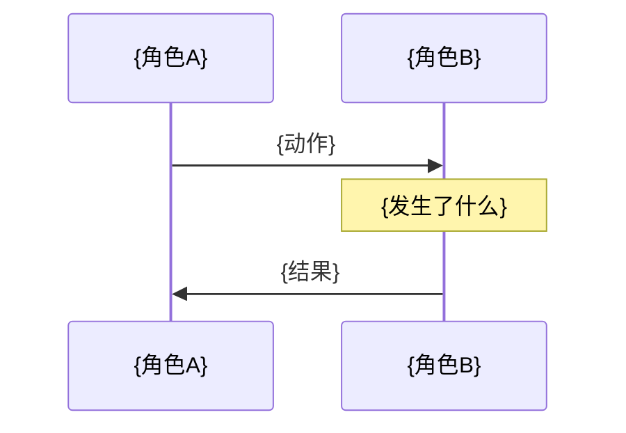

# 学习 Blog 模板

> 此模板供 `learning-blog` skill 使用。生成 Blog 时按用户选择的风格裁剪。

---

## 模板结构

```markdown
# {标题：清晰描述学到了什么}

> 日期：{YYYY-MM-DD} | 标签：`{tag1}` `{tag2}`

---

## 速查卡

### {子主题 1}

```powershell
# 核心命令
```

| 排错 | 原因 | 解决 |
| --- | --- | --- |
| {错误现象} | {根因} | {具体步骤} |

### {子主题 2}

（同上结构，可多个）

---

## 原理深挖

### 1. {概念名} — {一句话总结}

**核心问题：** {为什么要这个东西？它解决什么痛点？}

**底层方案：{技术名}**



**关键细节：**
- {细节 1，解释为什么这样设计}
- {细节 2，容易误解的点}
- {细节 3，和替代方案的对比}

---

### 2. {下一个概念}

（同上，每个概念一组）

---

## 输出成果

### 当前状态

```
{验证命令 + 输出}
```

### 在项目中的角色

| 工具/概念 | 在 M0-M5 中何时用到 |
| --- | --- |
| {名称} | {使用场景} |
```

---

## 风格裁剪指南

| 用户选择 | 保留的章节 |
| --- | --- |
| A — 纯速查 | 只保留 `速查卡` |
| B — 纯原理 | 只保留 `原理深挖` |
| C — 纯备忘 | 只保留 `速查卡` + `输出成果`（速查卡中去掉"排错表外的原理注释"） |
| 全部（默认） | 全部章节 |
